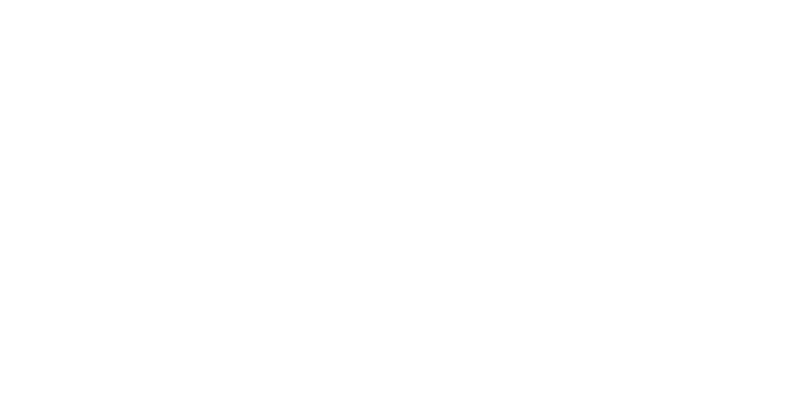

  

<h3 align="center">Vehicle Sharing System</h3>

    <b>Online Web App for Vehicle Sharing</b>
     
  

  <a  href="https://ridex.ml " target="blank" >View Demo</a>

 
 

RideX is very fast reliable vehicle sharing system for employee,students,senior citizen across the country. It is completey free and secure system for reaching at appropriate destination in meantime. It also offers fuel saving benefits and reduced ride cost by utilizing resources and saves environment from reducing pollution effects.
 

<b>Hosting server : &nbsp; Infinity Free Servers</b>

  
  
  
 	
  
  
  
  
  

